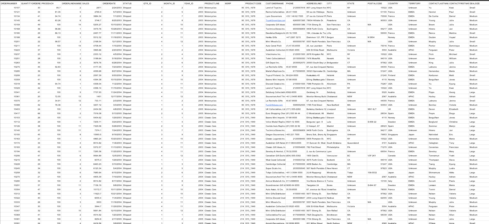
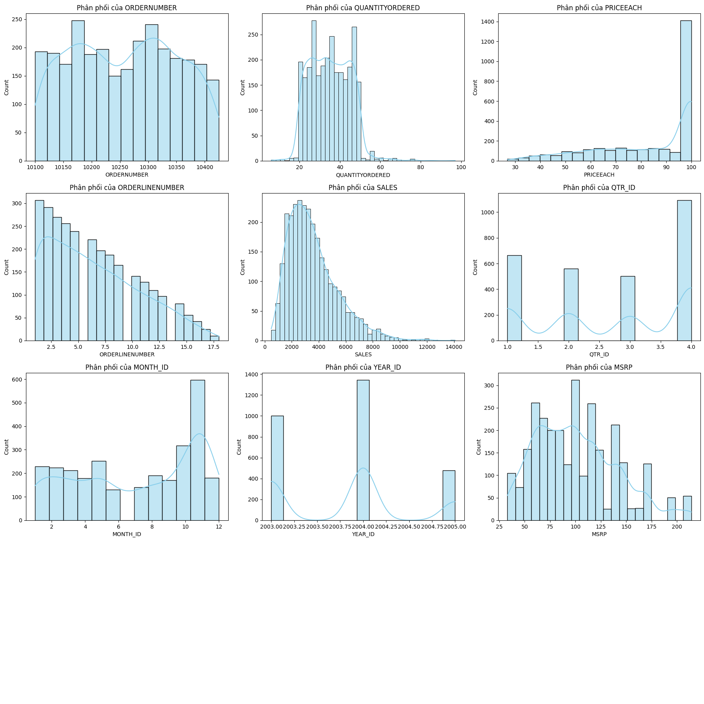
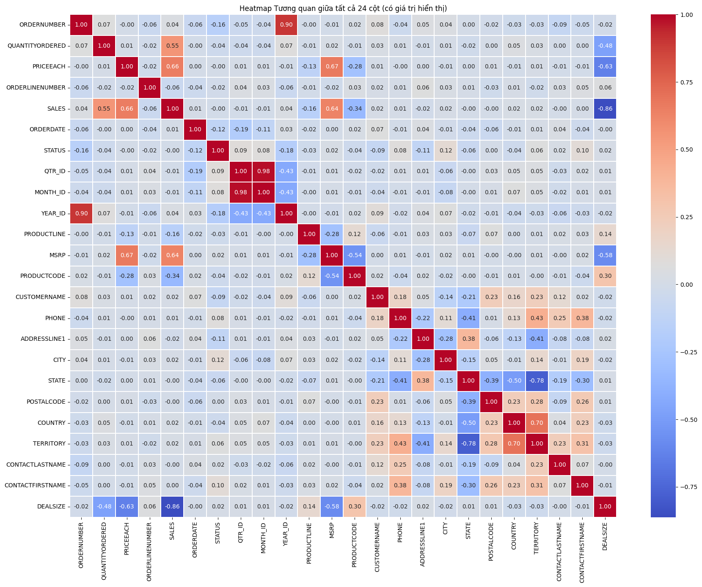
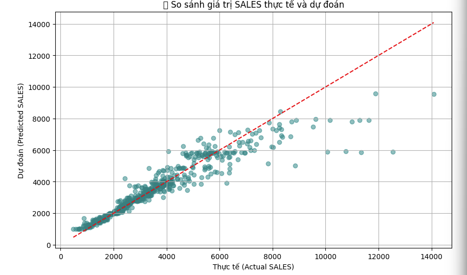

# 📊 Sales Data Analysis & Revenue Prediction

## 📌 Giới thiệu
Dự án phân tích dữ liệu bán hàng và dự đoán doanh thu sử dụng Python.  
Thực hiện các bước từ **làm sạch dữ liệu, phân tích – trực quan hóa, đến xây dựng mô hình Machine Learning** (Random Forest) nhằm tìm ra yếu tố ảnh hưởng chính đến doanh thu và hỗ trợ quyết định kinh doanh.

## 📂 Dataset
- File: `sales_data_sample.csv`
- Kích thước: ~2,800 dòng, 24 cột
- Một số cột quan trọng: `QUANTITYORDERED`, `PRICEEACH`, `SALES`, `DEALSIZE`, `PRODUCTLINE`, `YEAR_ID`, `MONTH_ID`

## 🛠️ Công cụ & Thư viện
- Python (Pandas, NumPy, Matplotlib, Seaborn, Scikit-learn)
- Google Colab / Jupyter Notebook

## 🔑 Các bước thực hiện
1. **Data Cleaning**  
   - Loại bỏ null, chuẩn hóa chuỗi  
   - Mã hóa dữ liệu dạng object bằng Label Encoding  

2. **Exploratory Data Analysis (EDA)**  
   - Thống kê mô tả  
   - Biểu đồ phân phối dữ liệu  
   - Heatmap tương quan giữa các biến  

3. **Machine Learning – Random Forest Regressor**  
   - Train/test split (80/20)  
   - Thử nghiệm nhiều cấu hình `n_estimators`, `max_depth`  
   - Đánh giá bằng R² và MSE  

4. **Feature Importance**  
   - Các yếu tố ảnh hưởng nhiều nhất đến doanh thu:  
     - `DEALSIZE` (quy mô đơn hàng)  
     - `QUANTITYORDERED` (số lượng đặt hàng)  
     - `PRICEEACH` (giá bán mỗi sản phẩm)  

## 📊 Kết quả
- Mô hình Random Forest đạt **R² ≈ 0.8**  
- MSE giảm đáng kể sau khi tối ưu tham số  
- Xác định rõ yếu tố quan trọng trong doanh thu → hỗ trợ xây dựng chiến lược kinh doanh  

## 📌 Trực quan
Một số biểu đồ chính:
- Phân phối biến số
- Heatmap tương quan
- Biểu đồ thực tế vs dự đoán (Actual vs Predicted Sales)

## 

### 🔹 Data

### 🔹 Trực quan dữ liệu

### 🔹 HeatMap

### 🔹 Kết quả

---
